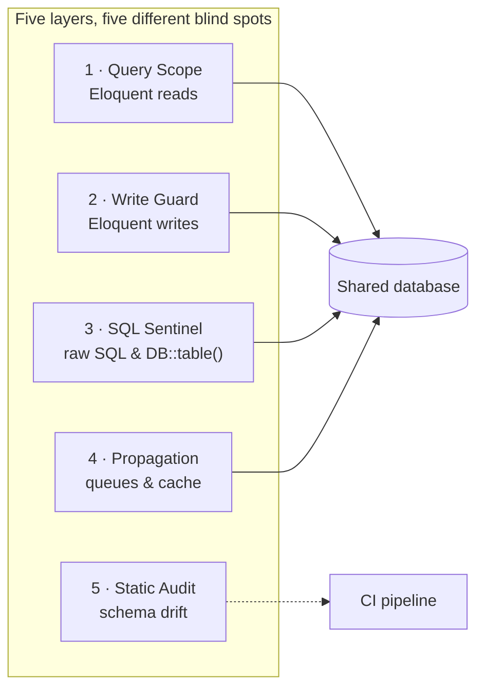
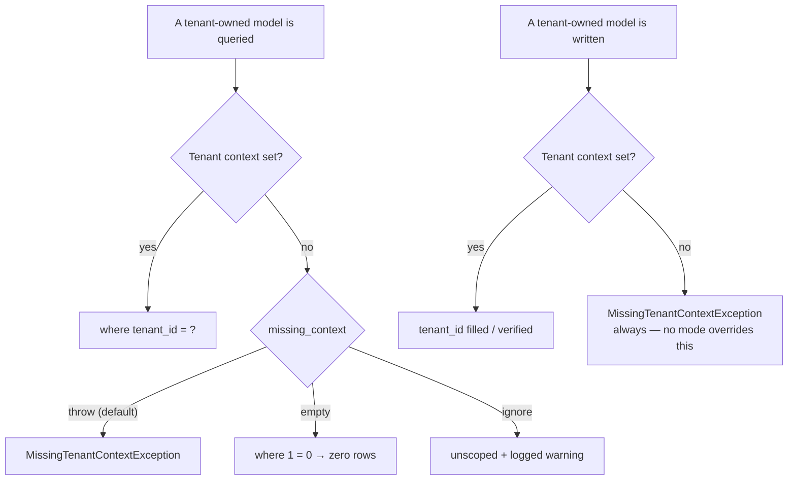
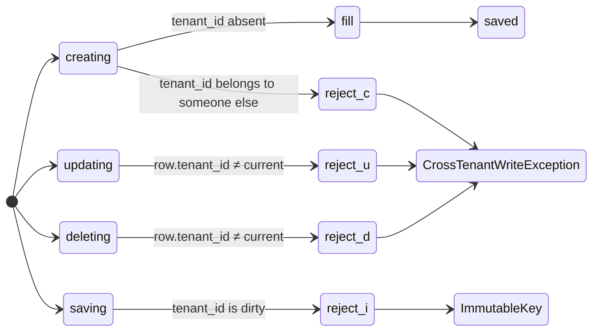
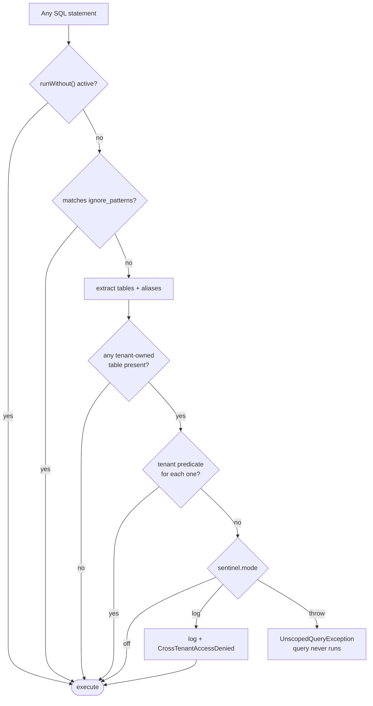
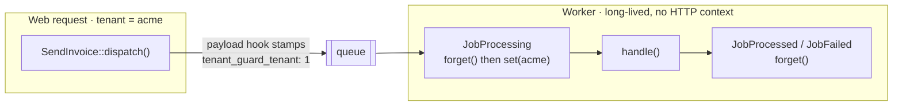
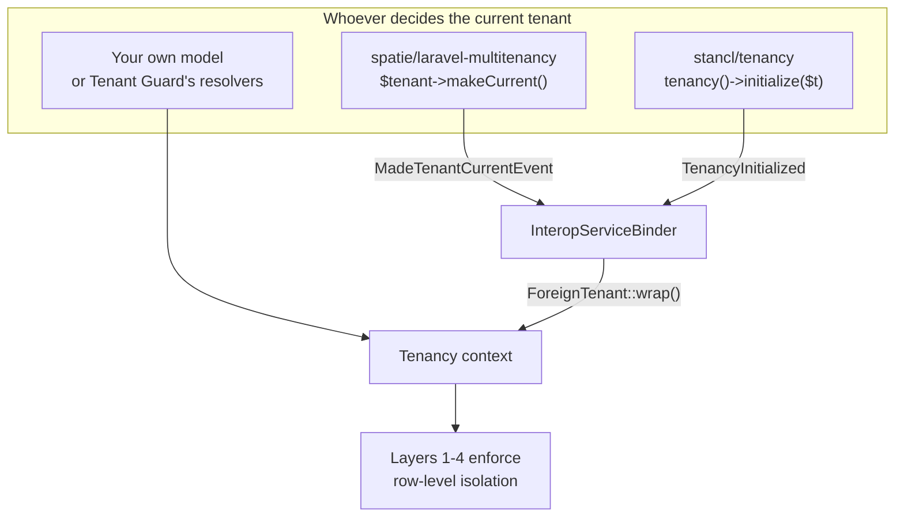
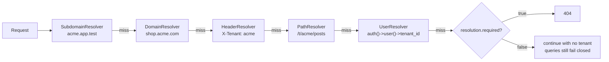
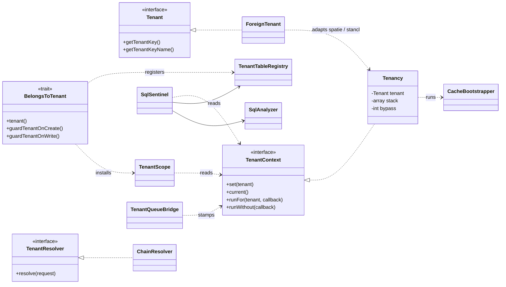

# Usage Guide

The full walkthrough of every layer, resolver, API method and gotcha. For a quick pitch and
install steps, see [README.md](README.md).

---

## The problem

In a shared-schema SaaS, every tenant's rows live in the same tables, separated only by a
`tenant_id` column. It is the cheapest tenancy model to run and **the easiest one to leak**.

```php
Post::all();                    // every tenant's posts
DB::table('posts')->get();      // Eloquent scopes never see this
$post->update([...]);           // whose post was that, again?
SendDigest::dispatch();         // and which tenant is the worker serving?
```

One forgotten `where()` is a cross-tenant data breach. Tenant Guard's answer is not a single
clever scope — it is **five independent layers**, each of which fails closed on its own.



---

## Where it fits

Tenant Guard is **not** a connection switcher. It is the layer the connection switchers do not
provide — and it is designed to sit *on top of* them, not instead of them.

| | `stancl/tenancy` | `spatie/laravel-multitenancy` | **Tenant Guard** |
|---|---|---|---|
| Isolation model | database / schema per tenant | database per tenant | **row per tenant, shared schema** |
| Mechanism | swaps the connection | swaps the connection | constrains every query |
| Protects raw SQL | n/a (separate DB) | n/a (separate DB) | **yes, pre-execution** |
| Protects central/shared tables | no | no | **yes** |
| Cost per tenant | a database | a database | a row |
| Works *with* the other two | — | — | **yes — see [Interoperability](#interoperability)** |

Pick a connection switcher when tenants need physical separation. Pick Tenant Guard when they
share a schema. Use both when part of your schema is shared and the rest is not.

---

## Threat model

Every row below has a test in [`tests/Feature/LeakHuntTest.php`](tests/Feature/LeakHuntTest.php).

| # | The mistake | Caught by |
|---|---|---|
| T1 | `Post::all()` with no scope | L1 |
| T2 | `Post::find($someoneElsesId)` | L1 |
| T3 | Saving a model loaded in another context | L2 |
| T4 | `tenant_id` arriving in a request payload | L2 |
| T5 | `DB::table('posts')->get()` | L3 |
| T6 | `DB::select('select * from posts')` | L3 |
| T7 | A queued job that lost its tenant | L4 + fail-closed |
| T8 | Two tenants colliding on one cache key | L4 |
| T9 | `exists:posts,id` confirming a foreign row | L5 |
| T10 | A new table shipped without `tenant_id` | L5 |
| T11 | A row written with a null tenant id | L2 |

---

## Installation

```bash
composer require ifds-oss/tenant-guard
php artisan tenant-guard:install
php artisan migrate
```

Then mark your tenant-owned models and protect your routes:

```php
use Ifds\TenantGuard\Concerns\BelongsToTenant;

class Post extends Model
{
    use BelongsToTenant;
}
```

```php
Route::middleware('tenant')->group(function () {
    Route::get('/posts', [PostController::class, 'index']);
});
```

That is the whole integration. The controller needs no `where()` clause:

```php
public function index()
{
    return Post::all();   // only ever this tenant's posts
}
```

---

## The request lifecycle

```mermaid
sequenceDiagram
    autonumber
    participant C as Client<br/>acme.app.test
    participant M as IdentifyTenant
    participant R as ChainResolver
    participant T as Tenancy
    participant A as Controller
    participant S as TenantScope
    participant DB as Database

    C->>M: GET /posts
    M->>R: resolve(request)
    R->>R: subdomain → domain → header → path → user
    R-->>M: Tenant "acme"
    M->>T: set(acme)
    T->>T: fire TenantResolved, run bootstrappers
    M->>A: next($request)
    A->>S: Post::all()
    S->>S: append where posts.tenant_id = 1
    S->>DB: select … where "posts"."tenant_id" = ?
    DB-->>A: acme's rows only
    A-->>C: 200 JSON
    Note over M,T: terminate() clears the context<br/>so Octane never bleeds
```



---

## Layer 1 — the query scope

`BelongsToTenant` installs a global scope that constrains every read, including `find()`,
relations and eager loads.

```php
TenantGuard::set($acme);

Post::count();                      // 3
Post::find($globexPostId);          // null
Post::with('comments')->get();      // comments are scoped too

Post::withoutTenantScope()->count();  // 8  — explicit, greppable
Post::forTenant($globex)->count();    // 5  — explicit, greppable
Post::allTenants()->count();          // 8  — alias for reporting
```

Global scopes apply when a query **executes**, not when it is built, so building a query
outside a tenant context is harmless — only running it is refused.

### The fail-closed matrix

The single most important setting in `config/tenant-guard.php`:



| Mode | Reads | Writes | Use when |
|---|---|---|---|
| `throw` *(default)* | exception | exception | every request is tenant-scoped |
| `empty` | zero rows | exception | central and tenant routes share models |
| `ignore` | unscoped, logged | exception | migrating an existing app — **never in production** |

Writes never honour `ignore`: a tenant-owned row with a null tenant id is invisible to every
tenant, forever.

---

## Layer 2 — the write guard



```php
TenantGuard::set($acme);

Post::create(['title' => 'Hello']);                     // tenant_id filled automatically
Post::create(['title' => 'X', 'tenant_id' => $other]);  // CrossTenantWriteException
$foreignPost->update(['title' => 'Mine now']);          // CrossTenantWriteException
$post->tenant_id = $other; $post->save();               // CrossTenantWriteException — immutable
```

The tenant key is rejected on mass assignment **regardless of `$fillable`/`$guarded`**, because
the check lives in the model event, not in the fillable list. `forceFill()` is not a way around
it either.

### The one sanctioned bypass

```php
TenantGuard::runWithout(function () {
    Post::withoutTenantScope()->where(...)->update([...]);   // deliberate, audited
});
```

`runWithout()` fires a `TenancyBypassed` event, so you can log every intentional crossing in
production. It also tells the SQL Sentinel to stand down, which means accidental unscoped
queries are still reported while deliberate ones are not.

---

## Layer 3 — the SQL Sentinel

Eloquent scopes cannot see `DB::table()` or `DB::select()`. The Sentinel can: it hooks
`Connection::beforeExecuting()`, so it inspects every statement **before the database runs it**.
A violation is blocked, not merely reported after the damage.



```php
config(['tenant-guard.sentinel.mode' => 'throw']);

DB::table('posts')->get();                                 // UnscopedQueryException
DB::select('select * from posts');                         // UnscopedQueryException
DB::table('posts')->where('tenant_id', $id)->get();        // fine
DB::table('plans')->get();                                 // fine — central table
Post::count();                                             // fine — L1 scoped it already
```

It understands aliases and joins, and reports **only the unscoped side**:

```sql
select * from "posts" join "comments" on …
 where "posts"."tenant_id" = ?          -- comments is unscoped → reported
```

**Recommended settings:** `off` in local development, `throw` in CI and staging, `log` in
production until the log is quiet, then `throw`. The analyser is a lexical heuristic by design —
it is the net *behind* layers 1 and 2, which is exactly why it has three modes and an
allow-list.

---

## Layer 4 — context propagation

### Queues



Nothing to configure and nothing to add to your jobs — a job dispatched inside a tenant runs
inside that tenant, and a worker never carries one job's tenant into the next.

A job dispatched with **no** tenant stays tenantless, so it fails closed rather than quietly
processing every tenant's rows.

### Cache

Two options, both explicit:

```php
// 1. Namespace individual keys — no global state touched.
TenantGuard::cache()->remember('settings', 60, fn () => $this->buildSettings());

// 2. Or swap the global cache prefix per tenant (opt in).
'bootstrappers' => [
    CacheBootstrapper::class => true,
],
```

With the bootstrapper on, `Cache::get('settings')` is tenant-scoped everywhere, including in
code that has never heard of Tenant Guard.

---

## Layer 5 — static audit and validation

### `tenant-guard:audit`

Runtime guards cannot catch code that has not been written yet. The audit walks your schema and
your models and reports four kinds of drift:

```console
$ php artisan tenant-guard:audit

+------+-----------------+----------------------+------------------------------------------------------------------+
|      | Type            | Subject              | Detail                                                           |
+------+-----------------+----------------------+------------------------------------------------------------------+
| FAIL | unguarded-table | legacy_notes         | has a `tenant_id` column but [App\Models\LegacyNote] does not     |
|      |                 |                      | use the BelongsToTenant trait                                    |
| WARN | unclassified    | unclassified_widgets | is neither tenant-owned nor on the central allow-list -           |
|      |                 |                      | classify it deliberately                                         |
+------+-----------------+----------------------+------------------------------------------------------------------+

1 error(s), 1 warning(s).
```

| Finding | Meaning |
|---|---|
| `unguarded-table` | the table has `tenant_id` but no model guards it |
| `missing-column` | a guarded model's table has no `tenant_id` |
| `unclassified` | the table is neither tenant-owned nor allow-listed — decide, don't assume |
| `missing-index` | a tenant table with no index leading with `tenant_id` |

It exits non-zero, so drop it straight into CI:

```yaml
- run: php artisan tenant-guard:audit --strict
```

### Validation rules

`exists:` and `unique:` are not tenant-aware. `exists:posts,id` will happily confirm another
tenant's row, which turns a validation message into an object-enumeration oracle.

```php
use Ifds\TenantGuard\Rules\TenantOwned;
use Ifds\TenantGuard\Rules\UniqueForTenant;

$request->validate([
    'post_id' => ['required', new TenantOwned(Post::class)],
    'slug'    => ['required', (new UniqueForTenant(Post::class))->ignore($post)],
]);
```

`UniqueForTenant` also fixes the opposite problem: a slug only has to be unique *within* a
tenant, and plain `unique:` makes two tenants fight over the same names.

---

## Interoperability

Tenant Guard follows whatever tenancy package your application already uses, by listening to
that package's own switch events. There is one source of truth, and it is not Tenant Guard.



It is on by default and a no-op when neither package is installed.

```php
// spatie: Tenant Guard follows makeCurrent() automatically
SpatieTenant::find($id)->makeCurrent();
Post::count();                     // already scoped

// stancl: same, via TenancyInitialized / TenancyEnded
tenancy()->initialize($stanclTenant);
Post::count();                     // already scoped

// anything else: hand it over directly, no contract required
TenantGuard::set($myOwnTenantModel);
```

**Why you would run both.** A connection switcher isolates the tables it moves. Anything left on
the central connection — plans, invoices, audit logs, a shared analytics schema — gets no
row-level protection from it. Tenant Guard supplies that half.

Both integrations are covered by real tests against the real packages:
[`tests/Interop/`](tests/Interop/) runs against `spatie/laravel-multitenancy` 4.x and
`stancl/tenancy` 3.x, and skips cleanly when they are absent.

### Trait name collision

`stancl/tenancy` also ships a trait called `BelongsToTenant`. Import ours under its alias:

```php
use Ifds\TenantGuard\Concerns\GuardedByTenant;
use Stancl\Tenancy\Database\Concerns\BelongsToTenant;

class Post extends Model
{
    use BelongsToTenant;
    use GuardedByTenant;    // identical to ours, different name
}
```

---

## Resolution

Resolvers are tried in order; the first hit wins.



```php
// config/tenant-guard.php
'resolvers' => [
    SubdomainResolver::class,
    DomainResolver::class,
    HeaderResolver::class,
    PathResolver::class,
    UserResolver::class,
],
```

Add your own rule without touching the config:

```php
TenantGuard::resolveUsing(fn (Request $request) => Tenant::firstWhere('api_key', $request->bearerToken()));
```

> **A note on `HeaderResolver`.** The value comes from the client, so pair it with
> authorisation — `UserResolver`, or a policy that checks the authenticated token really belongs
> to that tenant. It is meant for internal service-to-service calls and APIs where the token
> already pins the tenant.

### Middleware

| Alias | Does |
|---|---|
| `tenant` | resolve and establish the context; clears it on terminate |
| `tenant:required` | as above, but 404 when nothing resolves |
| `tenant.required` | 404 unless a context is already set |
| `tenant.central` | 404 **if** a context is set — for marketing pages, sign-up, ops |

---

## API

```php
TenantGuard::set($tenant);            // Tenant, foreign model, key, slug or domain
TenantGuard::current();               // ?Tenant
TenantGuard::id();                    // int|string|null
TenantGuard::check();                 // bool
TenantGuard::require();               // Tenant, or MissingTenantContextException
TenantGuard::forget();

TenantGuard::runFor($tenant, fn () => ...);   // nested; restores in a finally
TenantGuard::runWithout(fn () => ...);        // the sanctioned bypass
TenantGuard::each(fn ($tenant) => ...);       // once per tenant

TenantGuard::cache();                         // tenant-namespaced cache view
TenantGuard::resolveUsing(fn ($request) => ...);
```

### Events

| Event | Fired when |
|---|---|
| `TenantResolved` | a context is established or switched |
| `TenantForgotten` | the context is cleared |
| `TenancyBypassed` | `runWithout()` is entered — **listen to this in production** |
| `CrossTenantAccessDenied` | any layer refuses, before the exception is thrown |

### Commands

```bash
php artisan tenant-guard:install                       # publish config + migration
php artisan tenant-guard:audit [--strict] [--json]     # drift detector, exits non-zero
php artisan tenant-guard:list [--json]                 # every tenant
php artisan tenant-guard:run "posts:reindex" --tenant=acme
php artisan tenant-guard:run "posts:reindex" --all
```

---

## Testing

`InteractsWithTenancy` gives you assertions about the thing you are actually worried about.

```php
use Ifds\TenantGuard\Testing\InteractsWithTenancy;

class PostTest extends TestCase
{
    use InteractsWithTenancy;

    public function test_posts_do_not_leak(): void
    {
        $this->actingAsTenant($this->acme);

        $this->assertTenantScoped(Post::class);
        $this->assertNotTenantScoped(Plan::class);

        $this->assertIsolatedBetween(Post::class, $this->acme, $this->globex,
            fn () => Post::create(['title' => 'Secret']));

        $this->assertNoUnscopedQueries(fn () => $this->get('/dashboard'));

        $this->assertFailsClosed(fn () => $foreignPost->delete());
    }
}
```

| Helper | Asserts |
|---|---|
| `assertTenantScoped($model)` | the model's SQL constrains the tenant column |
| `assertNotTenantScoped($model)` | a central model is genuinely unscoped |
| `assertIsolatedBetween(...)` | a row created for A is invisible to B |
| `assertNoUnscopedQueries($fn)` | nothing in the callback bypassed the guard |
| `assertUnscopedQueryDetected($fn)` | the detector itself works — a negative control |
| `assertFailsClosed($fn)` | the operation was refused, not silently allowed |
| `countAllTenants($model)` | a deliberate cross-tenant count |

### Running this package's own suite

The package is developed against a real Laravel application under
[`workbench/`](workbench/), driven by Orchestra Testbench.

```bash
composer install
composer test          # 220 tests, 367 assertions
```

```
Unit ......... Tenancy · SqlAnalyzer · Resolvers
Feature ...... TenantScope · WriteGuard · SqlSentinel · MissingContext · QueuePropagation
               CacheIsolation · Middleware · ValidationRule · AuditCommand · Console · LeakHunt
Interop ...... spatie/laravel-multitenancy · stancl/tenancy · any foreign tenant model
```

You can also drive the workbench app by hand:

```bash
composer build
vendor/bin/testbench migrate:fresh --seed
vendor/bin/testbench tenant-guard:audit
vendor/bin/testbench serve

curl -H "Host: acme.example.test"   localhost:8000/posts   # {"tenant":1,"count":3,…}
curl -H "Host: globex.example.test" localhost:8000/posts   # {"tenant":2,"count":5,…}
```

### Version matrix

| Laravel | PHP | Testbench | Verified |
|---|---|---|---|
| 10 / 11 / 12 | 8.2+ | 8.x / 9.x / 10.x | full suite green |
| 13 | 8.3+ *(Laravel 13 itself requires it)* | 11.x | full suite green, plus a live workbench run |

Laravel 13 changed one thing that mattered here: a model may no longer be instantiated from
inside its own `boot()` call. `TenantTableRegistry` used to do exactly that when registering a
model's table — fixed by resolving the table name lazily on first read instead of at boot time.
Nothing else in the five layers needed to change.

---

## Gotchas

**`Job::dispatch()` returns a `PendingDispatch` that pushes on destruct.** Inside
`runFor()`, an arrow function returns that object, so it is destroyed *after* the context
unwinds and the job is queued with the wrong tenant — or none.

```php
// ✗ dispatches after the context is restored
TenantGuard::runFor($tenant, fn () => SendDigest::dispatch());

// ✓ the statement's value is discarded inside the closure
TenantGuard::runFor($tenant, function () {
    SendDigest::dispatch();
});
```

**Testbench flushes `Queue::createPayloadUsing()`** while resetting global state between tests,
which would silently strip the tenant from queued payloads. Call `bootQueuePropagation()` in
your `setUp()` — `InteractsWithTenancy` provides it.

**Index every tenant table on `tenant_id` first.** Every scoped query filters on it; without a
leading index each one degrades as your largest tenant grows. `tenant-guard:audit` warns about
this.

**The Sentinel is heuristic.** It parses SQL lexically, not with a full parser. Run it in `log`
mode first, add anything legitimate to `sentinel.ignore_patterns` or `central_tables`, then
promote to `throw`. It is a safety net, never the only layer.

**Consider Postgres Row-Level Security too.** Tenant Guard enforces isolation in the
application. RLS enforces it in the database, and the two compose well — set the session
variable from a `TenantResolved` listener.

---

## Configuration

Every option lives in `config/tenant-guard.php` and is documented inline. The ones that matter
most:

```php
'tenant_key'      => 'tenant_id',   // the discriminator column
'missing_context' => 'throw',       // throw | empty | ignore  ← read the matrix above
'sentinel' => [
    'mode' => env('TENANT_GUARD_SENTINEL', 'off'),   // off | log | throw
    'tenant_tables'  => [],          // authoritative; models also self-register
    'central_tables' => ['tenants', 'migrations', 'jobs', …],
],
'queue'  => ['propagate' => true],
'interop' => ['enabled' => true],   // follow spatie / stancl automatically
```

---

## Architecture



| Directory | Holds |
|---|---|
| `src/Concerns` | `BelongsToTenant`, `GuardedByTenant` |
| `src/Scopes` | layer 1 |
| `src/Sql` | layer 3 — sentinel, analyzer, table registry |
| `src/Queue` · `src/Listeners` · `src/Cache` | layer 4 |
| `src/Console` · `src/Rules` | layer 5 |
| `src/Resolvers` · `src/Http/Middleware` | resolution |
| `src/Interop` | spatie · stancl · any foreign tenant model |
| `src/Testing` | `InteractsWithTenancy` |

---

## License

MIT. See [LICENSE](LICENSE).
